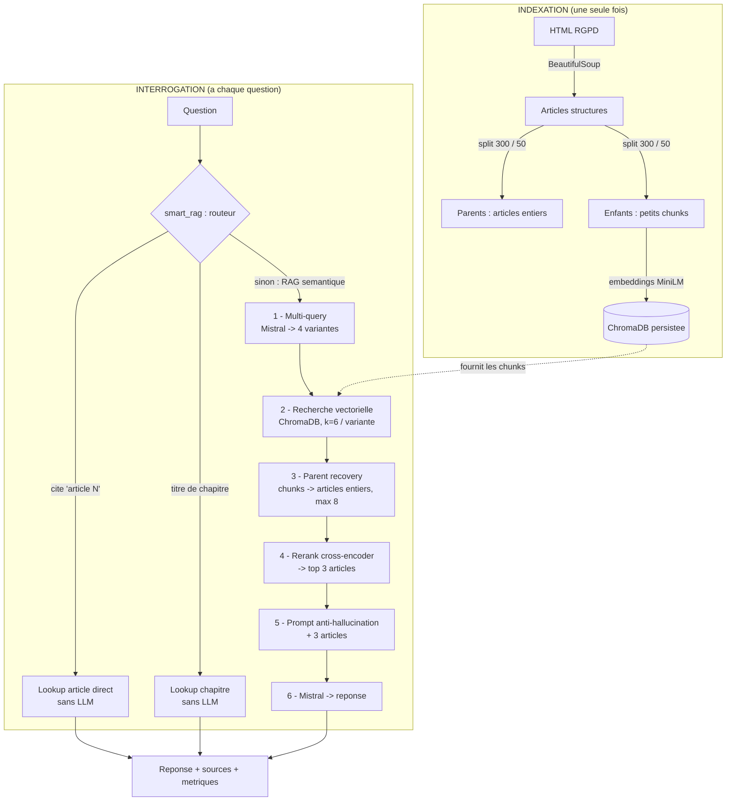

# GUIDE DU PROJET — Système RAG sur le RGPD

> Document de référence pour l'équipe et pour la présentation.
> Il décrit **en détail** ce que fait le projet, **comment le RAG fonctionne étape par étape**, et **pourquoi chaque technologie a été choisie**.
> Objectif : que tout le monde (et un assistant IA utilisé en présentation) puisse expliquer le projet **sans se tromper sur l'architecture**.

---

## Sommaire

1. [Vue d'ensemble](#1-vue-densemble)
2. [Glossaire express](#2-glossaire-express-à-lire-en-premier)
3. [Architecture du dépôt](#3-architecture-du-dépôt)
4. [Le pipeline RAG, étape par étape](#4-le-pipeline-rag-étape-par-étape)
5. [Le choix de chaque technologie (et pourquoi)](#5-le-choix-de-chaque-technologie-et-pourquoi)
6. [L'évaluation du RAG (RAGAS)](#6-lévaluation-du-rag-ragas)
7. [Points d'attention / honnêteté technique](#7-points-dattention--honnêteté-technique)
8. [Paramètres clés (récapitulatif)](#8-paramètres-clés-récapitulatif)
9. [FAQ — questions probables du jury](#9-faq--questions-probables-du-jury)

---

## 1. Vue d'ensemble

### Le problème
Un LLM seul (comme Mistral) « connaît » beaucoup de choses mais : (a) il peut **inventer** (halluciner), (b) il ne cite pas ses sources, (c) sa connaissance du RGPD est floue et non vérifiable. Pour un sujet **juridique**, c'est rédhibitoire.

### La solution : RAG (Retrieval-Augmented Generation)
Le **RAG** combine deux mondes :
- **Retrieval** (recherche d'information) : on va d'abord **chercher les vrais articles du RGPD** pertinents pour la question.
- **Generation** (génération) : on donne ces articles au LLM et on lui demande de répondre **uniquement à partir d'eux**.

> **Métaphore** : au lieu de demander à un étudiant de répondre de mémoire (risque d'invention), on lui dit « va chercher les bons articles à la bibliothèque, **puis** rédige ta réponse en t'appuyant dessus ». La réponse devient fondée, citable, vérifiable.

### Le corpus
Le texte officiel du **RGPD** — Règlement (UE) 2016/679 — au format HTML (récupéré d'EUR-Lex). Fichier : `backend/data/L_2016119FR.01000101.html`. Il contient ~11 chapitres et ~99 articles.

### Les trois briques du projet
| Brique | Rôle | Dossier |
|---|---|---|
| **Backend** | API REST qui orchestre tout le pipeline RAG | `backend/` |
| **Frontend** | Interface de chat (web) | `rag-frontend/` |
| **Évaluation** | Mesure objective de la qualité du RAG | `evaluation/` |

---

## 2. Glossaire express (à lire en premier)

- **LLM** (Large Language Model) : modèle de langage qui génère du texte. Ici **Mistral**.
- **Embedding** : transformation d'un texte en **vecteur de nombres** qui capture son *sens*. Deux textes de sens proche ont des vecteurs proches. C'est ce qui permet la « recherche par sens » (et pas juste par mots-clés).
- **Base vectorielle** : base de données qui stocke ces vecteurs et sait retrouver les plus proches d'un vecteur donné. Ici **ChromaDB**.
- **Chunk** : un *morceau* de texte. On découpe les longs documents en petits chunks pour les embedder.
- **Reranker (cross-encoder)** : un second modèle qui **re-classe** des documents par pertinence réelle vis-à-vis de la question (plus précis que la recherche vectorielle, mais plus lent → on l'applique seulement sur une petite présélection).
- **Multi-query** : reformuler la question en plusieurs variantes pour ne pas rater de documents à cause d'une formulation.
- **Parent/child** : on **embedde de petits chunks** (précis pour la recherche) mais on **renvoie au LLM l'article entier** (contexte riche).
- **RAGAS** : bibliothèque qui **note** automatiquement la qualité d'un RAG.

---

## 3. Architecture du dépôt

```
AI31_Projet_RAG/
├── README.md                  # Documentation d'installation/lancement
├── GUIDE_PROJET.md            # ← CE document (explication approfondie)
├── requirements.txt           # Dépendances Python (uniques, racine)
│
├── backend/                   # ── API FastAPI ──────────────────────────
│   ├── run.py                 # Lance uvicorn sur :8000
│   ├── scripts/build_index.py # Construit l'index ChromaDB depuis le HTML
│   ├── data/
│   │   ├── L_2016119FR...html  # Texte officiel du RGPD (corpus source)
│   │   └── chroma_db/          # Index vectoriel persisté (généré)
│   └── app/
│       ├── main.py            # Crée l'app FastAPI + initialise le RAG au démarrage
│       ├── core/
│       │   ├── config.py      # Tous les réglages (modèles, k, chunk_size…)
│       │   ├── container.py   # Assemble le pipeline une seule fois au démarrage
│       │   └── logging.py
│       ├── api/
│       │   ├── query.py       # Endpoints /query, /query/stream, /query/filter
│       │   └── health.py      # /health, /ready
│       ├── schemas/query.py   # Formats de requête/réponse (Pydantic)
│       └── services/          # ★ LE CŒUR DU RAG ★
│           ├── indexing.py    # HTML → documents parent/enfant
│           ├── vectorstore.py # Embeddings + ChromaDB
│           ├── llm.py         # Client Mistral
│           ├── retriever.py   # Multi-query + parent recovery + rerank
│           └── pipeline.py    # Routeur intelligent + RAG complet + prompt
│
├── rag-frontend/              # ── Interface React (Vite + Redux + Tailwind) ──
│
└── evaluation/                # ── Évaluation RAGAS ─────────────────────
    ├── evaluation_ragas.py    # Script unique : charge le RAG, génère, score
    ├── gold_set.json          # 10 questions principales (8 conceptuelles + 2 pointues)
    ├── gold_set2.json         # 10 questions plus faciles (définitions)
    └── resultats_*.csv        # Scores par question (généré, un CSV par gold set)
```

**Le RAG vit dans `backend/app/services/`.** Les 5 fichiers de ce dossier sont le cœur à comprendre.

---

## 4. Le pipeline RAG, étape par étape

Le système a **deux temps** : une **indexation** faite une fois (hors ligne), puis une **interrogation** à chaque question (en ligne).

### PARTIE A — INDEXATION (une seule fois, au build de l'index)

> Fichiers : `indexing.py` + `vectorstore.py`, déclenchés par `scripts/build_index.py` ou au premier démarrage.

#### Étape A.1 — Parsing du HTML → structure (`indexing.py : parse_rgpd_html`)
On lit le HTML du RGPD avec **BeautifulSoup**. On parcourt chaque `<div>` de chapitre (`id="cpt_..."`), puis chaque `<div>` d'article (`id="art_..."`), et on extrait pour chacun :
- le **chapitre** et son titre,
- le **numéro d'article** et son titre,
- le **contenu** de l'article (paragraphes `oj-normal`).

Résultat : une liste structurée `[{chapitre, titre_chapitre, contenu: [{article, titre_article, contenu_article}, ...]}, ...]`.

#### Étape A.2 — Découpage parent / enfant (`indexing.py : build_documents`)
Pour **chaque article**, on crée :
- **1 document « parent »** = l'article **complet** (chapitre + titre + tout le texte). C'est ce qu'on donnera au LLM.
- **N documents « enfants »** = de **petits chunks de ~300 caractères** (chevauchement 50), découpés par `RecursiveCharacterTextSplitter`. C'est ce qu'on va **embedder** et stocker dans la base vectorielle.

Chaque document porte des **métadonnées** : `chapitre`, `titre_chapitre`, `article`, `titre_article`, `source`, et surtout un **`parent_id`**.

> **Détail crucial** : le `parent_id` est **déterministe** = `"{chapitre}::{article}"` (ex. `"CHAPITRE II::Article 7"`). Au début c'était un `uuid` aléatoire — ça créait un bug : les chunks stockés en base pointaient vers des `parent_id` qui changeaient à chaque redémarrage → on récupérait **0 article**. L'ID déterministe garantit que le lien chunk → article tient dans le temps.

#### Étape A.3 — Embeddings + stockage vectoriel (`vectorstore.py`)
- On charge le modèle d'embeddings **`paraphrase-multilingual-MiniLM-L12-v2`** (HuggingFace, sur CPU).
- On transforme **chaque chunk enfant** en vecteur, et on stocke (vecteur + texte + métadonnées) dans **ChromaDB** (collection `rgpd_chunks`), **persisté sur disque** dans `backend/data/chroma_db/`.
- Persisté = construit **une fois**, rechargé instantanément aux démarrages suivants (pas de ré-embedding).

> **Pourquoi embedder les enfants et pas les parents ?** Un petit chunk donne une recherche sémantique **précise** (le vecteur n'est pas « dilué » par un long texte). Mais une fois le bon chunk trouvé, on veut donner au LLM **tout l'article** pour qu'il ait le contexte complet. D'où le couple parent/child.

### PARTIE B — INTERROGATION (à chaque question)

> Fichiers : `pipeline.py` (orchestration) + `retriever.py` (recherche) + `llm.py` (génération).

Point d'entrée : `RAGPipeline.smart_rag(question, mode)`.

#### Étape B.0 — Le routeur intelligent (`pipeline.py : smart_rag`)
Avant de lancer la machinerie lourde, on regarde la question :

1. **La question cite « article N » ?** (regex `article\s+(\d+|premier)`)
   → **Lookup direct** dans les articles par métadonnées, **sans LLM ni recherche vectorielle**. On renvoie le contenu exact de l'article. (Rapide, exact, 0 hallucination possible.)
2. **La question contient un titre de chapitre ?**
   → **Lookup chapitre** : on liste tous les articles du chapitre, **sans LLM**.
3. **Sinon** → on lance le **RAG sémantique complet** (`full_rag`, ci-dessous).

> **Idée** : pour les questions factuelles évidentes (« que dit l'article 17 ? »), inutile de payer un appel LLM et une recherche vectorielle — un accès direct aux métadonnées est plus rapide **et** plus fiable.

#### Étape B.1 — Multi-query (`retriever.py : _generate_queries`)
On demande au LLM **Mistral** de reformuler la question en **4 variantes** différentes.
> **Pourquoi ?** La recherche sémantique dépend de la formulation. « Délai en cas de fuite de données » et « notification d'une violation à la CNIL » visent le même article (33) mais avec des mots différents. Multi-query **élargit le filet** pour ne pas rater le bon article à cause d'un vocabulaire trop éloigné.

#### Étape B.2 — Recherche vectorielle (`retriever.py : _multi_query_search`)
Pour **chaque** des 4 variantes, on interroge ChromaDB et on récupère les **`k=6` chunks** les plus proches (similarité cosinus). On agrège tous les résultats et on **déduplique** par contenu.

#### Étape B.3 — Récupération des parents (`retriever.py : retrieve_parents`)
Les chunks trouvés sont de petits morceaux. On remonte, via leur `parent_id`, aux **articles complets** correspondants (jusqu'à **`parent_docs_top_k=8`** articles distincts).
> C'est le « parent recovery » : on a cherché finement (chunks), on renvoie largement (articles entiers).

#### Étape B.4 — Reranking par cross-encoder (`retriever.py : rerank`)
On a jusqu'à 8 articles candidats. On les **re-classe** avec le **cross-encoder `ms-marco-MiniLM-L-6-v2`** : ce modèle prend la paire `(question, article)` et donne un **score de pertinence réelle**. On garde les **`reranker_top_n=3` meilleurs**.
> **Pourquoi un reranker ?** La recherche vectorielle est rapide mais approximative (elle compare deux vecteurs pré-calculés indépendamment). Le cross-encoder lit **question et document ensemble** → bien plus précis, mais trop lent pour toute la base. On l'utilise donc en **2ᵉ étage**, seulement sur la présélection. C'est le compromis classique « *retrieve fast, rerank precise* ».

#### Étape B.5 — Construction du contexte + prompt (`pipeline.py : _format_parents` + `RGPD_PROMPT`)
On met en forme les 3 articles retenus en un bloc de **contexte**, inséré dans un **prompt très cadré** qui impose au LLM :
- de répondre **uniquement** à partir du contexte fourni,
- de **ne jamais inventer** d'article absent du contexte (règle anti-hallucination explicite),
- de structurer la réponse en **5 sections** (réponse directe, articles concernés, explication, points de vigilance, recommandation),
- d'ajouter un disclaimer « ne constitue pas un avis juridique ».

#### Étape B.6 — Génération (`llm.py` + Mistral)
On envoie le prompt à **Mistral** (`mistral-small-latest`, température 0.3). On récupère la réponse, on nettoie le marqueur de prompt, et on construit la réponse finale `QueryResponse` : **answer** (texte) + **sources** (articles utilisés, avec un score) + **metrics** (latence, tokens, stratégie).

### Schéma récapitulatif

```
INDEXATION (1 fois)
  HTML RGPD ─(BeautifulSoup)→ articles structurés
            ─(split 300/50)→ parents (articles entiers) + enfants (chunks)
            ─(embeddings MiniLM)→ ChromaDB (chunks vectorisés, persistés)

INTERROGATION (par question)
  question
    └─ smart_rag :  « article N » ? ─oui→ lookup direct (sans LLM)
                    titre chapitre ? ─oui→ lookup chapitre (sans LLM)
                    sinon ↓ full_rag
        1. multi-query    : Mistral → 4 variantes
        2. recherche      : ChromaDB, k=6 chunks / variante → dédup
        3. parent recovery: chunks → articles entiers (≤ 8)
        4. rerank         : cross-encoder → top 3 articles
        5. prompt         : 3 articles + consignes anti-hallucination
        6. génération     : Mistral → réponse en 5 sections + sources
```

---

### Diagramme du pipeline (rendu graphique sur GitHub / VSCode)



---

## 5. Le choix de chaque technologie (et pourquoi)

| Technologie | Rôle | Pourquoi ce choix |
|---|---|---|
| **Mistral** (`mistral-small-latest`) | LLM de génération (et juge d'éval) | LLM performant en **français**, API simple, **clé gratuite**. `small` = bon rapport qualité/latence/coût pour un projet étudiant. Température 0.3 = réponses stables sans être robotiques. |
| **LangChain** | Orchestration (documents, splitter, retriever, prompts) | Standard de l'écosystème RAG. Fournit `Document`, `RecursiveCharacterTextSplitter`, l'interface `as_retriever`, les `PromptTemplate` → évite de tout réécrire à la main. |
| **ChromaDB** | Base vectorielle | **Léger, local, zéro config serveur** (s'exécute en process, persiste sur disque). Parfait pour un corpus de cette taille. Pas besoin d'un Pinecone/Weaviate cloud. |
| **sentence-transformers `paraphrase-multilingual-MiniLM-L12-v2`** | Embeddings | Modèle **multilingue** (donc bon en **français**), **léger** (tourne sur **CPU**, pas besoin de GPU), gratuit et local. « MiniLM » = compact et rapide. |
| **cross-encoder `ms-marco-MiniLM-L-6-v2`** | Reranker | Reranker de référence entraîné sur MS MARCO (pertinence question/passage). Léger (CPU). Améliore nettement la précision du top-k. |
| **Stratégie parent/child** | Indexation/retrieval | Concilie **précision de recherche** (petits chunks) et **richesse du contexte** (articles entiers). Un article RGPD entier serait trop gros à embedder précisément ; un chunk seul serait trop pauvre pour répondre. |
| **Multi-query** | Recherche | Robustesse au **vocabulaire** : ne pas rater le bon article à cause d'une reformulation. |
| **Reranking (2 étages)** | Recherche | « Retrieve fast, rerank precise » : on combine la **vitesse** de la recherche vectorielle et la **précision** du cross-encoder. |
| **Smart router** | Pré-traitement | **Économie + fiabilité** : les questions factuelles évidentes (un article/chapitre précis) sont traitées sans LLM, donc plus vite et sans risque d'hallucination. |
| **Prompt structuré + règle anti-hallucination** | Génération | Sujet **juridique** = zéro tolérance à l'invention. Le prompt force le LLM à rester dans le contexte fourni et à structurer sa réponse. |
| **FastAPI + Uvicorn** | API backend | Framework Python **async**, rapide, avec **docs interactives** auto (`/docs`) et validation **Pydantic** intégrée. |
| **Pydantic** | Schémas | Validation et typage stricts des requêtes/réponses → contrat clair avec le frontend. |
| **Injection de dépendances (`container.py`)** | Architecture | Les objets lourds (modèles, index, pipeline) sont construits **une seule fois au démarrage** et réutilisés à chaque requête (sinon on rechargerait les modèles à chaque question). |
| **React + Vite + Redux + Tailwind** | Frontend | Stack web moderne : Vite (dev rapide), Redux Toolkit (état des sessions/messages), Tailwind (style). |
| **RAGAS** | Évaluation | Standard pour **évaluer un RAG** avec des métriques dédiées récupération + génération. |

---

## 6. L'évaluation du RAG (RAGAS)

> Fichier unique : `evaluation/evaluation_ragas.py`. Questions externalisées dans `gold_set.json` / `gold_set2.json`.

### Le principe
On joue le rôle d'un **examinateur** qui note le RAG. RAGAS utilise un **LLM juge** (ici **Mistral**) pour calculer 4 notes. On a un **gold set** : des questions + leur **réponse de référence** (la vérité terrain rédigée à la main).

### Les 4 métriques
| Phase | Métrique | Ce qu'elle mesure |
|---|---|---|
| **Récupération** | **Context Precision** | Les bons articles sont-ils **en haut** du classement ? (pas noyés) |
| **Récupération** | **Context Recall** | A-t-on récupéré **tous** les articles nécessaires ? (rien oublié) |
| **Génération** | **Faithfulness** | La réponse est-elle **fondée** sur les articles récupérés ? (= pas d'hallucination) |
| **Génération** | **Response Relevancy** | La réponse **colle-t-elle à la question** posée ? |

### Comment ça tourne
1. Le script charge le RAG, puis pour chaque question : génère la réponse + récupère les contextes.
2. Il construit un **juge Mistral dédié** (4096 tokens, température 0 → JSON déterministe et parsable).
3. Il score **chaque question, métrique par métrique**, séquentiellement.
4. Il exporte `resultats_<gold_set>.csv` et affiche les 4 moyennes.

### Lancement
```bash
python evaluation/evaluation_ragas.py                 # gold_set.json (par défaut)
python evaluation/evaluation_ragas.py gold_set2.json  # questions plus faciles
```

### Limite assumée (à dire en présentation)
Le juge est **Mistral**, le même modèle que celui évalué → **biais d'auto-évaluation** possible. C'est acceptable ici car les métriques sont surtout des **vérifications factuelles** (« cette phrase est-elle dans le contexte ? ») et 2 des 4 métriques se comparent à une **référence**. Pour une éval plus rigoureuse, on utiliserait un **juge différent** (autre LLM, ou humain).

---

## 7. Points d'attention / honnêteté technique

À connaître pour **ne pas survendre** le projet en présentation :

- **Les 4 « modes RAG » du frontend (Adaptatif / CRAG / HyDE / Self-RAG) sont cosmétiques.** Le backend reçoit bien un paramètre `mode`, mais il ne change **que l'étiquette** « stratégie » affichée dans les métriques — l'algorithme exécuté est **toujours le même** (`smart_rag` → `full_rag`). CRAG, HyDE et Self-RAG **ne sont pas réellement implémentés**. (À dire honnêtement, ou à présenter comme « extensions prévues ».)
- **Le « streaming » SSE est simulé.** L'endpoint `/query/stream` calcule d'abord la réponse complète, puis la renvoie **mot par mot** avec un petit délai. Ce n'est pas un vrai streaming token-par-token du LLM.
- **ID déterministe obligatoire.** Si on remet des UUID aléatoires dans `indexing.py`, le RAG récupère 0 contexte (voir Étape A.2).
- **Environnement Python.** Le projet tourne sur Python 3.14 ; certaines dépendances anciennes ne compilent pas → `requirements.txt` épingle des versions **récentes et fonctionnelles** (langchain 0.3.x, chromadb 1.5.x, pydantic 2.13…).
- **L'évaluation contourne des soucis de compat** (executor parallèle de RAGAS instable sur Python 3.14/Windows → scoring séquentiel ; patch de fusion des `token_usage` de `langchain_mistralai` ; sortie console forcée en UTF-8). Détails commentés dans `evaluation_ragas.py`.

---

## 8. Paramètres clés (récapitulatif)

| Paramètre | Valeur | Où | Sens |
|---|---|---|---|
| Modèle d'embeddings | `paraphrase-multilingual-MiniLM-L12-v2` | `config.py` | Vectorisation multilingue (CPU) |
| Modèle LLM (app) | `mistral-small-latest` | `config.py` | Génération des réponses |
| Température LLM (app) | `0.3` | `config.py` | Stabilité des réponses |
| `max_tokens` LLM (app) | `512` | `config.py` | Longueur max de réponse |
| Reranker | `ms-marco-MiniLM-L-6-v2` | `config.py` | Re-classement précis |
| `chunk_size` / `overlap` | `300` / `50` | `indexing.py` | Taille des chunks enfants |
| `retriever_k` | `6` | `config.py` | Chunks récupérés par variante |
| `multi_query_variants` | `4` | `config.py` | Reformulations de la question |
| `parent_docs_top_k` | `8` | `config.py` | Articles parents candidats |
| `reranker_top_n` | `3` | `config.py` | Articles finaux envoyés au LLM |
| Base vectorielle | ChromaDB, collection `rgpd_chunks` | `vectorstore.py` | Stockage persistant |
| Juge d'éval | Mistral, 4096 tokens, T=0 | `evaluation_ragas.py` | Notation RAGAS |

---

## 9. FAQ — questions probables du jury

Réponses **courtes et défendables** aux questions les plus probables.

**Q1. Pourquoi un RAG plutôt qu'un LLM seul ?**
Un LLM seul peut **inventer** et ne cite pas ses sources. Sur un sujet **juridique**, il faut des réponses **fondées et vérifiables**. Le RAG force le modèle à s'appuyer sur les **vrais articles du RGPD** récupérés, et on affiche les sources.

**Q2. Pourquoi pas une simple recherche par mots-clés (Ctrl+F / TF-IDF) ?**
La recherche par mots-clés rate les **synonymes** et reformulations. « Fuite de données » et « violation de données » désignent la même chose avec des mots différents. La **recherche sémantique** (embeddings) compare le **sens**, pas les mots exacts.

**Q3. Comment garantissez-vous l'absence d'hallucination ?**
Trois garde-fous : (1) le **prompt** interdit explicitement d'inventer un article absent du contexte ; (2) on ne donne au LLM **que** les articles récupérés ; (3) on **mesure** la fidélité avec la métrique **Faithfulness** de RAGAS (≈ 0,87 dans nos tests).

**Q4. Que fait le système si la réponse n'est pas dans le RGPD ?**
Le prompt impose de répondre « *Je ne peux pas répondre avec certitude à partir des extraits RGPD fournis* » plutôt que d'inventer.

**Q5. Pourquoi découper les articles en chunks, et pourquoi la stratégie parent/child ?**
On **embedde de petits chunks** (~300 caractères) car un vecteur sur un petit texte est **plus précis** pour la recherche. Mais on **renvoie au LLM l'article entier** (le « parent ») pour qu'il ait le **contexte complet**. On combine ainsi précision de recherche et richesse de réponse.

**Q6. Embedding vs reranker : quelle différence, pourquoi les deux ?**
L'**embedding** (bi-encoder) calcule le vecteur d'un texte **indépendamment** → rapide, on peut indexer toute la base, mais approximatif. Le **reranker** (cross-encoder) lit **la question et le document ensemble** → bien plus précis, mais trop lent pour toute la base. On combine : recherche **rapide** (embeddings) puis re-classement **précis** (reranker) sur une petite présélection.

**Q7. À quoi sert le multi-query ?**
À ne pas rater le bon article à cause d'une **formulation**. Mistral reformule la question en 4 variantes, on cherche avec chacune, on fusionne. Ça améliore le **rappel** (Context Recall).

**Q8. À quoi sert le « smart router » ?**
Pour les questions factuelles évidentes (« que dit l'article 17 ? »), il accède **directement** à l'article par ses métadonnées, **sans LLM ni recherche vectorielle** → plus **rapide** et **zéro hallucination**. Le RAG sémantique complet n'est lancé que pour les vraies questions de fond.

**Q9. Pourquoi Mistral et pas ChatGPT / Gemini ?**
Mistral est **performant en français**, propose une **clé API gratuite**, et `mistral-small-latest` offre un bon compromis qualité / vitesse / coût pour un projet étudiant. L'architecture reste agnostique : on pourrait changer de LLM.

**Q10. Pourquoi ChromaDB ?**
**Léger, local, sans serveur à déployer** : il s'exécute dans le process Python et persiste sur disque. Idéal pour ce volume (≈ 99 articles). Pas besoin d'une solution cloud (Pinecone, Weaviate).

**Q11. Comment avez-vous évalué la qualité ? Pourquoi RAGAS ?**
Avec **RAGAS** et un **gold set** de 10 questions (+ réponses de référence). 4 métriques : 2 pour la **récupération** (Context Precision, Context Recall), 2 pour la **génération** (Faithfulness, Response Relevancy). C'est le standard pour évaluer un RAG de façon objective.

**Q12. Le juge est Mistral, comme le générateur — n'est-ce pas biaisé ?**
Oui, c'est une **limite assumée** (biais d'auto-évaluation). Elle est atténuée car les métriques sont surtout des **vérifications factuelles** et 2 sur 4 se comparent à une **référence** humaine. Pour plus de rigueur : un **juge différent** (autre LLM ou humain).

**Q13. Quelle est la latence d'une requête ?**
Quelques secondes (~5 s) pour une question sémantique (multi-query + recherche + rerank + génération). **Quasi-instantané** pour un lookup direct via le smart router. Les modèles sont chargés **une fois** au démarrage (≈ 15-20 s), pas à chaque requête.

**Q14. Comment changer de corpus ou passer à l'échelle ?**
Le pipeline est **générique** : il suffit de remplacer le parsing dans `indexing.py` pour un autre corpus, puis de reconstruire l'index. Pour un gros volume, ChromaDB peut être remplacé par une base vectorielle distribuée, mais l'architecture (chunk → embed → search → rerank → generate) reste identique.

**Q15. Quelles sont les limites actuelles ?**
(1) Les modes CRAG / HyDE / Self-RAG de l'UI sont **cosmétiques** (non implémentés) ; (2) le streaming est **simulé** ; (3) le juge d'évaluation est le même modèle que le générateur ; (4) le corpus est limité au texte du RGPD (pas la jurisprudence ni les lignes directrices CNIL).

---

*Document généré pour l'équipe AI31 — UTC, Printemps 2026. À jour de l'état actuel du code.*
